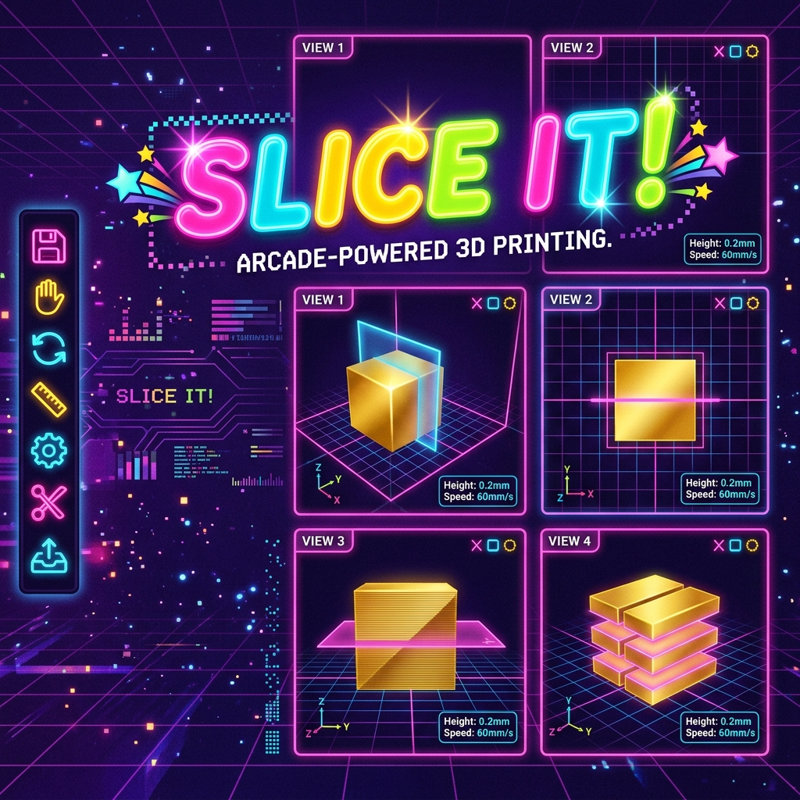
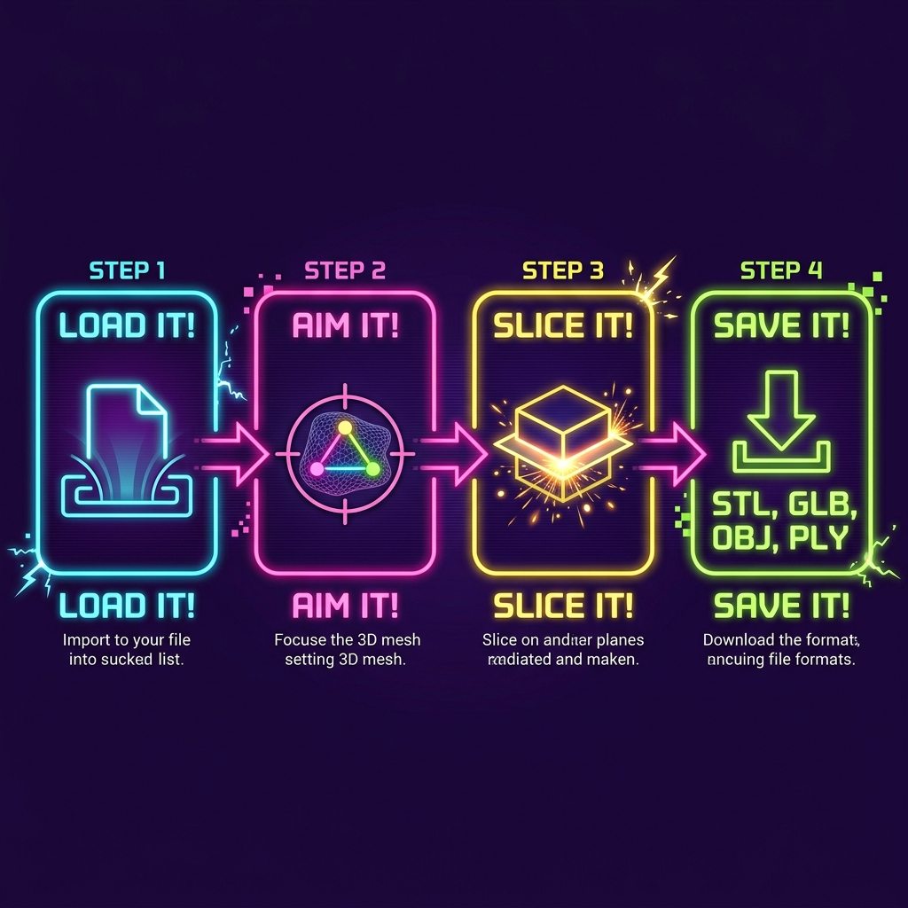
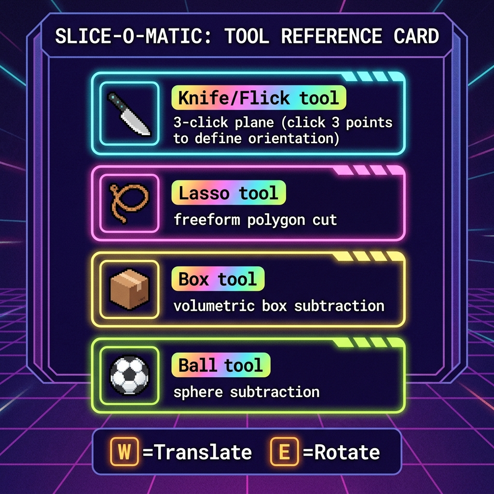

<div align="center">



# SliceIT!

**The raddest 3D mesh slicer on the web. 🔪✨**

[](https://react.dev)
[](https://threejs.org)
[](https://docs.pmnd.rs/react-three-fiber)
[](https://manifoldcad.org)
[](LICENSE)

</div>

---

## What is it?

**SliceIT!** is a browser-based 3D mesh slicer built for speed, simplicity, and pure 90s **RADICAL** energy. No installations. No sign-ups. No nonsense. Drop a mesh, aim your knife, press one button — sliced.

> *"Inspired by the glory days of Bop It! — where every action had a satisfying name and zero learning curve."*

Born out of frustration with bloated desktop tools that require a PhD just to trim a model before printing, SliceIT! delivers professional-grade boolean cutting operations inside a browser tab, wrapped in a neon-drenched aesthetic that makes you *want* to slice things.

---

## ⚡ The Four Steps



| Step | Action | What happens |
|------|--------|-------------|
| 📂 | **LOAD IT!** | Drop any supported mesh file or use a built-in preset (Box/Sphere) |
| 🔪 | **AIM IT!** | Choose a cutting tool and position your slicing geometry |
| ✂️ | **SLICE IT!** | Boolean subtraction runs in a WebWorker — UI stays responsive |
| 💾 | **SAVE IT!** | Export the result in any supported format |

---

## 🎮 Features

### Core
- **4-viewport CAD layout** — ISO, Front, Back, Bottom views simultaneously in a single window
- **Multi-window sync** — open multiple browser tabs, they stay in sync via `BroadcastChannel`
- **Non-blocking slicing** — CSG runs in a dedicated `WebWorker` via [Comlink](https://github.com/GoogleChromeLabs/comlink)
- **Manifold-3D backend** — watertight, topologically valid output on *any* input mesh (including non-manifold geometry)
- **Undo / Redo** — full history for both anchor placements and slice operations (↩️/↪️)
- **Import → render instantly** — camera auto-fits to model on load, no extra steps

### Cutting Tools



| Tool | Shortcut | Description |
|------|----------|-------------|
| 🔪 **Flick It!** | `K` | Click 3 points to define a cutting plane. Plane spawns at scene origin. Translate/Rotate with the widget. |
| 🪢 **Lasso It!** | `L` | Place a freeform polygon (3–9 pts). The polygon shape defines the cut boundary. |
| 📦 **Box It!** | `B` | Axis-aligned box subtraction |
| ⚽ **Ball It!** | `S` | Spherical subtraction |

#### Knife tool flow in detail:
```
1. Press 🔪 (or K)
2. Click 3 points anywhere in any viewport
   → anchors + connecting lines guide your plane orientation  
3. Plane appears at ORIGIN, normal derived from your 3 clicks
   → dots and lines vanish (clean viewport)
4. Use the ↔ MOVE or ↻ ROTATE pill widget to fine-tune
   (also: W = translate mode, E = rotate mode)
5. Press SLICE IT! — done
```

### Transform Controls
When the cutting plane is deployed, a pill-style widget appears above it:

| Button | Keyboard | Action |
|--------|----------|--------|
| ↔ MOVE | `W` | Translate the cutting plane along any axis |
| ↻ ROTATE | `E` | Tilt and spin the plane to any angle |

---

## 📂 File Format Support

### Import formats

| Format | Extension | Notes |
|--------|-----------|-------|
| STL | `.stl` | Binary and ASCII, most common for 3D printing |
| OBJ | `.obj` | Wavefront, with or without MTL |
| glTF | `.gltf` | JSON glTF with external assets |
| GLB | `.glb` | Binary glTF (self-contained, recommended) |
| PLY | `.ply` | Stanford polygon format |
| 3MF | `.3mf` | 3D Manufacturing Format |
| XYZ | `.xyz` | Point cloud |

### Export formats

| Format | Extension | Compatible with |
|--------|-----------|-----------------|
| GLB | `.glb` | Blender, Unity, Unreal, Sketchfab, MeshLab ✅ |
| STL | `.stl` | All 3D printers, Meshmixer, Cura |
| OBJ | `.obj` | Maya, 3ds Max, Blender, most DCC tools |
| PLY | `.ply` | MeshLab, CloudCompare, Python (Open3D) |
| glTF | `.gltf` | Web viewers, Babylon.js, model-viewer |

> All exports are stamped with a mesh name and UV attributes for maximum downstream compatibility (Blender, MeshLab, Sketchfab import cleanly).

---

## ⚠️ Model Size

SliceIT! runs entirely in the browser. Large meshes consume browser memory.

| File Size | Behavior |
|-----------|----------|
| < 100 MB | ✅ Fully supported, best performance |
| 100 MB – 500 MB | ⚠️ Warning displayed, loading continues — expect slower CSG operations |
| > 500 MB | ❌ Rejected at import — browser memory limit |

**Recommended:** models up to ~50 MB provide the smoothest slicing experience. For very dense meshes (>500k faces), consider decimating in Blender first.

---

## 🚀 Running Locally

```bash
# Clone
git clone https://github.com/your-username/SliceIT.git
cd SliceIT

# Install
npm install

# Dev server (hot reload)
npm run dev

# Production build
npm run build
```

Requires **Node 18+**. Tested on Node 24.

The dev server starts at `http://localhost:5173`. No environment variables required — SliceIT! runs entirely on the client.

---

## 🧰 Tech Stack

| Layer | Technology |
|-------|-----------|
| UI Framework | React 18 + TypeScript |
| 3D Rendering | Three.js + React Three Fiber |
| CSG Engine | [manifold-3d](https://github.com/elalish/manifold) (WASM) + three-csg-ts fallback |
| State | Zustand with `subscribeWithSelector` |
| Worker Bridge | [Comlink](https://github.com/GoogleChromeLabs/comlink) |
| 3D Helpers | @react-three/drei (TransformControls, OrbitControls, Html) |
| Build | Vite 6 |
| Loaders | three-stdlib (STL, OBJ, PLY, glTF, 3MF loaders) |

### Architecture at a glance

```
Browser Main Thread          WebWorker Thread
┌─────────────────────┐      ┌──────────────────────────┐
│  React (R3F) UI     │      │  slicing.worker.ts        │
│  ┌───────────────┐  │      │  ┌────────────────────┐  │
│  │  Zustand Store│──┼─ Comlink ──▶ manifold-3d WASM │  │
│  └───────────────┘  │      │  └────────────────────┘  │
│  ┌───────────────┐  │      │  ┌────────────────────┐  │
│  │ CuttingPlane  │  │      │  │ three-csg-ts       │  │
│  │ (knife/lasso) │  │      │  │ (fallback)         │  │
│  └───────────────┘  │      │  └────────────────────┘  │
│  ┌───────────────┐  │      └──────────────────────────┘
│  │ ViewCamera ×4 │  │
│  │ (4-up layout) │  │
│  └───────────────┘  │
└─────────────────────┘
```

---

## ⌨️ Keyboard Shortcuts

| Key | Action |
|-----|--------|
| `K` | Activate Knife / Flick It! tool |
| `L` | Activate Lasso tool |
| `B` | Activate Box tool |
| `S` | Activate Sphere tool |
| `W` | Switch plane to **Translate** mode |
| `E` | Switch plane to **Rotate** mode |
| `↩️` Undo | Remove last anchor click (or undo last slice) |
| `↪️` Redo | Restore removed anchor (or redo last slice) |

---

## 🪲 Known Limitations

- **Manifold WASM cold-start** — the first slice after load has ~1 s WASM init latency; subsequent slices are fast.
- **Non-solid meshes** — Manifold repairs winding and welds duplicates automatically, but completely open shells (e.g., architectural section cuts, terrain patches) may produce unexpected geometry.
- **Lasso subtraction** — the lasso tool currently extrudes the polygon into a half-space subtraction (same as knife but polygon-shaped cutter). Per-vertex lasso filtering is planned for Phase 5.
- **Box / Sphere tools** — transform positioning planned; boolean engine is integrated but the UI transform handles for these primitives are under active development.
- **No texture support** — UV maps and materials from imported files are not displayed (geometry only). Export preserves placeholder UVs for downstream use.

---

## 🗺️ Roadmap

- [ ] Phase 5 — BVH-accelerated point cloud lasso filtering
- [ ] Lasso tool with true per-vertex polygon filtering
- [ ] Box / Sphere transform gizmos
- [ ] Scan QR code → open on mobile for quick inspection
- [ ] Share sliced model via link (OPFS persistent storage)

---

## 📄 License

MIT — do whatever you want with it. Just don't call it **BOP IT!** (that's trademarked).

---

<div align="center">
  <strong>Made with 💜, neon, and an unhealthy obsession with the 90s.</strong>
</div>
