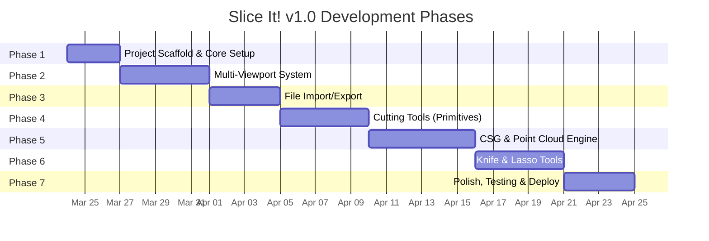

# Slice It! — v1.0 Implementation Plan

> **Version**: 1.0.0  
> **Last Updated**: 2026-03-23  
> **Estimated Total Effort**: ~120 hours  

---

## Phase Overview



---

## Phase 1: Project Scaffold & Core Setup (3 days)

### Objectives
- Initialize Vite + React project
- Configure TailwindCSS 4
- Set up Zustand store skeleton
- Create base layout (toolbar, viewport grid, status bar)
- Configure Web Worker build pipeline

### Tasks

| # | Task | File(s) | Est. Hours | Details |
|---|---|---|---|---|
| 1.1 | Initialize Vite + React 19 project | `/` | 1h | `npx -y create-vite@latest ./ --template react-ts` |
| 1.2 | Install core dependencies | `package.json` | 1h | See [Dependency List](#dependency-list) |
| 1.3 | Configure TailwindCSS 4 | `tailwind.config.ts`, `index.css` | 1h | Dark mode default, design tokens |
| 1.4 | Create base layout shell | `src/App.tsx`, `src/layouts/` | 3h | Header toolbar + 3x3 grid + status bar |
| 1.5 | Create Zustand store skeleton | `src/store/useStore.ts` | 2h | All state fields, stub actions |
| 1.6 | Configure Vite for Web Workers | `vite.config.ts` | 1h | `worker` plugin, WASM support |
| 1.7 | Set up linting & formatting | `.eslintrc`, `.prettierrc` | 1h | ESLint + Prettier + TypeScript strict |
| 1.8 | Create dev/build scripts | `package.json` | 0.5h | `dev`, `build`, `preview`, `lint` |
| 1.9 | Set up Cross-Origin Isolation headers | `vite.config.ts` | 0.5h | Required for `SharedArrayBuffer` |

### Acceptance Criteria
- [ ] `npm run dev` serves the app at `localhost:5173`
- [ ] 3x3 grid of empty viewport containers renders
- [ ] Toolbar with placeholder buttons renders
- [ ] Zustand store initializes with default state
- [ ] Dark theme applied globally
- [ ] Web Worker can be imported and executed

### Dependency List

```bash
# Core
npm install react@latest react-dom@latest

# 3D
npm install three @react-three/fiber @react-three/drei three-mesh-bvh

# State
npm install zustand

# CSG
npm install manifold-3d

# Worker Communication
npm install comlink

# Triangulation
npm install earcut

# Styling
npm install tailwindcss @tailwindcss/vite

# Dev
npm install -D typescript @types/react @types/react-dom @types/three
npm install -D vite @vitejs/plugin-react
npm install -D eslint prettier
npm install -D @types/earcut
```

---

## Phase 2: Multi-Viewport System (5 days)

### Objectives
- Implement 9 synchronized Drei `<View>` viewports
- Configure camera positions (6 ortho + 3 perspective)
- Implement active view selection with visual highlighting
- Add orbit controls for perspective views
- Auto-fit cameras to model bounding sphere

### Tasks

| # | Task | File(s) | Est. Hours | Details |
|---|---|---|---|---|
| 2.1 | Create `ViewportGrid` component | `src/components/ViewportGrid.tsx` | 4h | 3x3 responsive grid, ref forwarding |
| 2.2 | Create `ViewportPanel` component | `src/components/ViewportPanel.tsx` | 3h | Individual viewport with label, border, click handler |
| 2.3 | Implement `<Canvas>` + `<View>` setup | `src/components/SceneCanvas.tsx` | 4h | Single canvas, 9 View components |
| 2.4 | Configure cameras per view | `src/config/viewConfigs.ts` | 2h | 6 ortho + 3 perspective camera configs |
| 2.5 | Implement `ViewCamera` component | `src/components/ViewCamera.tsx` | 3h | Orthographic/Perspective switching, auto-fit |
| 2.6 | Add active view selection | `src/store/useStore.ts` | 1h | `activeViewIndex` state + `setActiveView` |
| 2.7 | Active view visual indicator | `src/components/ViewportPanel.tsx` | 1h | Cyan glow border on active view |
| 2.8 | Add OrbitControls to perspective views | `src/components/ViewCamera.tsx` | 2h | Drei `OrbitControls`, perspective only |
| 2.9 | Implement camera auto-fit | `src/utils/cameraUtils.ts` | 2h | Compute bounding sphere, set camera `D` |
| 2.10 | Add grid helpers to ortho views | `src/components/ViewHelpers.tsx` | 1h | `GridHelper`, `AxesHelper` |
| 2.11 | Viewport label overlay | `src/components/ViewportPanel.tsx` | 1h | "Top", "Front", etc. text overlay |

### Acceptance Criteria
- [ ] 9 viewports render in a 3x3 grid
- [ ] Clicking a viewport highlights it as active
- [ ] Ortho views show fixed-angle cameras
- [ ] Perspective views allow orbit/pan/zoom
- [ ] All views share the same scene data
- [ ] View labels display correctly
- [ ] Grid helpers visible in ortho views

---

## Phase 3: File Import/Export (4 days)

### Objectives
- Implement drag-and-drop file upload
- Support STL, OBJ, glTF/GLB, PLY, 3MF, XYZ formats
- Auto-detect mesh vs. point cloud
- Implement export in STL, PLY, OBJ, glTF formats
- Center and normalize imported geometry

### Tasks

| # | Task | File(s) | Est. Hours | Details |
|---|---|---|---|---|
| 3.1 | Create `FileDropZone` component | `src/components/FileDropZone.tsx` | 3h | Drag-and-drop + click-to-browse |
| 3.2 | Implement format detection | `src/utils/fileUtils.ts` | 1h | Extension-based format routing |
| 3.3 | Create loader factory | `src/loaders/loaderFactory.ts` | 2h | Returns correct Three.js loader per format |
| 3.4 | Implement individual loaders | `src/loaders/*.ts` | 4h | STL, OBJ, GLTF, PLY, 3MF, XYZ wrappers |
| 3.5 | Mesh vs. point cloud detection | `src/utils/geometryUtils.ts` | 2h | Check for indices, face normals |
| 3.6 | Geometry normalization | `src/utils/geometryUtils.ts` | 2h | Center at origin, compute bounding sphere |
| 3.7 | Import modal/UI | `src/components/ImportModal.tsx` | 2h | Progress bar, file info display |
| 3.8 | Create export factory | `src/exporters/exporterFactory.ts` | 2h | STL, PLY, OBJ, GLTF exporters |
| 3.9 | Export modal/UI | `src/components/ExportModal.tsx` | 2h | Format selection, download trigger |
| 3.10 | File size validation | `src/utils/fileUtils.ts` | 1h | Warn >100MB, block >500MB |
| 3.11 | Wire import/export to toolbar | `src/components/Toolbar.tsx` | 1h | Import/Download buttons |

### Acceptance Criteria
- [ ] Drag-and-drop uploads work for all 6 formats
- [ ] Model renders in all 9 viewports after import
- [ ] Mesh and point cloud types are correctly detected
- [ ] Geometry is centered and cameras auto-fit
- [ ] Export produces valid downloadable files
- [ ] File size limits are enforced with user feedback

---

## Phase 4: Cutting Tools — Primitives (5 days)

### Objectives
- Implement Box, Sphere, Cylinder, and Plane cutting tools
- Add TransformControls for positioning/scaling/rotating
- Implement real-time clipping plane preview
- Add toolbar tool selection UI

### Tasks

| # | Task | File(s) | Est. Hours | Details |
|---|---|---|---|---|
| 4.1 | Create `CuttingTool` base component | `src/components/tools/CuttingTool.tsx` | 3h | Shared logic: position, rotation, scale, material |
| 4.2 | Implement `BoxCutter` | `src/components/tools/BoxCutter.tsx` | 2h | Semi-transparent box with wireframe |
| 4.3 | Implement `SphereCutter` | `src/components/tools/SphereCutter.tsx` | 2h | Semi-transparent sphere |
| 4.4 | Implement `CylinderCutter` | `src/components/tools/CylinderCutter.tsx` | 2h | Semi-transparent cylinder |
| 4.5 | Implement `PlaneCutter` | `src/components/tools/PlaneCutter.tsx` | 2h | Infinite plane with visual indicator |
| 4.6 | Integrate `TransformControls` | `src/components/tools/CuttingTool.tsx` | 3h | Drei TransformControls, mode toggle (translate/rotate/scale) |
| 4.7 | Implement clipping plane preview | `src/hooks/useClippingPlanes.ts` | 4h | Compute clipping planes from tool shape |
| 4.8 | Real-time clip preview rendering | `src/components/ModelRenderer.tsx` | 3h | Apply clipping planes to model material |
| 4.9 | Tool selection toolbar UI | `src/components/Toolbar.tsx` | 3h | Tool buttons with icons, active state |
| 4.10 | TransformControls mode toggle | `src/components/Toolbar.tsx` | 1h | Translate/Rotate/Scale mode buttons |
| 4.11 | Tool state sync across views | `src/store/useStore.ts` | 2h | Tool position/rotation/scale in store |

### Acceptance Criteria
- [ ] All 4 primitive tools can be placed in the scene
- [ ] TransformControls allow positioning, rotating, and scaling
- [ ] Clipping planes provide real-time visual preview of the cut
- [ ] Tool selection is reflected in toolbar UI
- [ ] Tool position is synchronized across all 9 viewports
- [ ] Semi-transparent tool rendering doesn't obscure the model

---

## Phase 5: CSG & Point Cloud Engine (6 days)

### Objectives
- Initialize manifold3d WASM in a Web Worker
- Implement mesh CSG subtraction pipeline
- Implement point cloud spatial filtering
- Wire "Slice!" button to worker pipeline
- Implement undo/redo stack

### Tasks

| # | Task | File(s) | Est. Hours | Details |
|---|---|---|---|---|
| 5.1 | Set up manifold3d WASM loading | `src/workers/slicing.worker.ts` | 4h | Download, init WASM module in worker |
| 5.2 | Create Comlink worker wrapper | `src/workers/slicing.api.ts` | 2h | Typed API surface |
| 5.3 | Implement `subtractMesh` | `src/workers/slicing.worker.ts` | 6h | Convert BufferGeometry → Manifold mesh → CSG → back |
| 5.4 | Implement `filterPointCloud` | `src/workers/slicing.worker.ts` | 4h | Box/sphere/cylinder spatial filtering |
| 5.5 | Serialize/deserialize geometry for worker | `src/utils/workerGeometry.ts` | 3h | BufferGeometry ↔ Float32Array + Uint32Array |
| 5.6 | "Slice!" button + execution flow | `src/components/Toolbar.tsx`, `src/store/useStore.ts` | 3h | Button triggers `executeSlice()`, updates state |
| 5.7 | Progress indicator during slicing | `src/components/StatusBar.tsx` | 2h | Loading spinner, progress text |
| 5.8 | Implement undo stack | `src/store/useStore.ts` | 3h | Max 10 states, proper geometry disposal |
| 5.9 | Implement redo stack | `src/store/useStore.ts` | 1h | Redo from undo |
| 5.10 | Error handling & fallbacks | `src/utils/errorHandling.ts` | 2h | Toast notifications, graceful failures |
| 5.11 | BVH spatial index for point clouds | `src/utils/pointCloudBVH.ts` | 3h | three-mesh-bvh integration |

### Acceptance Criteria
- [ ] manifold3d WASM loads successfully in Web Worker
- [ ] Box/Sphere/Cylinder CSG subtract works on mesh models
- [ ] Point cloud filtering removes points inside cutting shapes
- [ ] "Slice!" button triggers the full pipeline
- [ ] UI remains responsive during slicing operations
- [ ] Undo/Redo navigates through geometry states
- [ ] Errors are caught and displayed as toasts

---

## Phase 6: Knife & Lasso Tools (5 days)

### Objectives
- Implement knife (point-to-point) drawing tool
- Implement lasso (freeform) drawing tool
- Convert 2D drawn shapes to 3D extrusion volumes
- Integrate with CSG/filtering pipeline

### Tasks

| # | Task | File(s) | Est. Hours | Details |
|---|---|---|---|---|
| 6.1 | Create `DrawingCanvas` overlay | `src/components/tools/DrawingCanvas.tsx` | 4h | 2D canvas overlay on active viewport |
| 6.2 | Implement knife point input | `src/components/tools/KnifeTool.tsx` | 4h | Click-to-add points, double-click to close |
| 6.3 | Implement lasso drag input | `src/components/tools/LassoTool.tsx` | 4h | Mouse drag, sample points, auto-close |
| 6.4 | 2D polygon → 3D extrusion | `src/utils/extrusionUtils.ts` | 6h | Project screen coords to world, earcut triangulate, extrude along camera normal |
| 6.5 | Knife clipping preview | `src/hooks/useClippingPlanes.ts` | 3h | Approximate clip from knife polygon |
| 6.6 | Lasso clipping preview | `src/hooks/useClippingPlanes.ts` | 2h | Approximate clip from lasso polygon |
| 6.7 | Wire knife/lasso to CSG pipeline | `src/store/useStore.ts` | 2h | Same executeSlice flow as primitives |
| 6.8 | Visual feedback during drawing | `src/components/tools/DrawingCanvas.tsx` | 2h | Dotted line preview, vertex markers |
| 6.9 | Cancel/reset drawing | `src/components/tools/DrawingCanvas.tsx` | 1h | Escape key, right-click cancel |

### Acceptance Criteria
- [ ] Knife tool: click points to create cutting polygon
- [ ] Lasso tool: drag to draw freeform cutting shape
- [ ] Both tools restricted to orthographic views in v1
- [ ] Drawing preview renders in real-time
- [ ] Completed shapes are extruded into 3D volumes
- [ ] Extrusion volumes correctly slice meshes and filter point clouds
- [ ] Escape/right-click cancels the drawing

---

## Phase 7: Polish, Testing & Deploy (4 days)

### Objectives
- Add keyboard shortcuts
- Implement toast notification system
- Add loading/skeleton states
- Browser compatibility testing
- Deploy to Vercel
- Performance optimization pass

### Tasks

| # | Task | File(s) | Est. Hours | Details |
|---|---|---|---|---|
| 7.1 | Keyboard shortcuts | `src/hooks/useKeyboardShortcuts.ts` | 2h | Ctrl+Z, Ctrl+Y, Del, 1-9, Escape |
| 7.2 | Toast notification system | `src/components/Toast.tsx` | 2h | Success, error, warning, info toasts |
| 7.3 | Loading states | `src/components/LoadingOverlay.tsx` | 2h | Skeleton UI, progress bars |
| 7.4 | Welcome/empty state | `src/components/EmptyState.tsx` | 2h | "Drop a file to get started" UI |
| 7.5 | Responsive layout | `src/layouts/`, CSS | 2h | Mobile: stack viewports. Tablet: 2x2. Desktop: 3x3. |
| 7.6 | Performance profiling | — | 3h | Lighthouse, Chrome DevTools, memory leaks |
| 7.7 | Browser testing | — | 3h | Chrome, Firefox, Safari, Edge |
| 7.8 | SEO & meta tags | `index.html` | 1h | Title, description, OG tags |
| 7.9 | Favicon & branding | `public/` | 1h | SVG favicon, app icons |
| 7.10 | Vercel deployment | `vercel.json` | 1h | Config, env vars, domain |
| 7.11 | README documentation | `README.md` | 2h | Setup, usage, contributing |

### Acceptance Criteria
- [ ] All keyboard shortcuts work
- [ ] Toast notifications display for all user actions
- [ ] Empty state is visually polished
- [ ] App loads in < 3 seconds on 3G
- [ ] Works on Chrome, Firefox, Safari, Edge
- [ ] Deployed and accessible on Vercel
- [ ] README is complete

---

## Cross-Cutting Concerns

### Code Quality Standards

| Standard | Tool | Config |
|---|---|---|
| TypeScript Strict | `tsconfig.json` | `strict: true`, `noImplicitAny: true` |
| Linting | ESLint | React + TypeScript rules |
| Formatting | Prettier | 2-space indent, single quotes, trailing commas |
| Git Hooks | (optional) | lint-staged + husky for pre-commit |

### Naming Conventions

| Type | Convention | Example |
|---|---|---|
| Components | PascalCase | `ViewportGrid.tsx` |
| Hooks | camelCase, `use` prefix | `useClippingPlanes.ts` |
| Utils | camelCase | `geometryUtils.ts` |
| Store | camelCase, `use` prefix | `useStore.ts` |
| Workers | kebab-case, `.worker` suffix | `slicing.worker.ts` |
| Types/Interfaces | PascalCase | `ViewConfig`, `ToolTransform` |
| Constants | SCREAMING_SNAKE | `MAX_FILE_SIZE`, `MAX_UNDO_STATES` |

### Git Workflow

| Branch | Purpose |
|---|---|
| `main` | Production-ready code, auto-deploys to Vercel |
| `dev` | Integration branch for feature work |
| `feature/*` | Individual feature branches |
| `fix/*` | Bug fix branches |

### Commit Convention

```
type(scope): description

feat(viewport): implement 9-view grid layout
fix(csg): handle non-manifold geometry edge case
chore(deps): update manifold3d to 2.5.1
docs(readme): add development setup section
```

---

## Risk Register

| Risk | Likelihood | Impact | Mitigation |
|---|---|---|---|
| manifold3d WASM fails on degenerate geometry | Medium | High | Fallback to three-bvh-csg; pre-validate geometry |
| 9 viewports cause GPU performance issues | Medium | Medium | LOD for inactive views; benchmark early in Phase 2 |
| Large file uploads exhaust browser memory | Low | High | Hard limit at 500MB; streaming parsing if feasible |
| Knife/lasso extrusion produces invalid meshes | Medium | Medium | Validate extrusion output; retry with simplified polygon |
| Three.js/R3F version incompatibility | Low | Low | Pin versions in package.json |
| WASM CORS issues in deployed environment | Low | Medium | Self-host WASM file; test early on Vercel |
